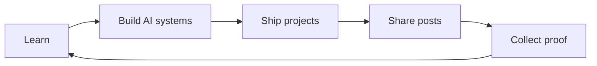

# KalyanHub


> A personal learning, AI engineering, and portfolio hub for Saragadam Kalyan — built to learn in public, ship practical systems, and document the journey.

[](https://kalyanhub.netlify.app)
[](https://github.com/kalyan870)
[](https://www.linkedin.com/in/saragadamkalyan/)

## About Kalyan

**Saragadam Kalyan** is a Computer Science student and aspiring AI Engineer based in the Greater Visakhapatnam Area. His work turns ideas into practical AI applications across Generative AI, LLM applications, AI agents, Python, APIs, computer vision, analytics, and full-stack development.

### Focus

AI Engineering · Generative AI · LLM Applications · AI Agents · Python & APIs · Full-Stack Development · Computer Vision · Product Thinking

### Experience

**Artificial Intelligence Intern — Internship Studio**  
Remote · May 2026 — Present

Developed an AI-powered face recognition application using PCA, ANN, Python, Streamlit, NumPy, Pandas, Matplotlib, and Scikit-learn. Built practical skills in data preprocessing, visualization, model evaluation, debugging, and deployment.

## Live links

- **KalyanHub:** [kalyanhub.netlify.app](https://kalyanhub.netlify.app)
- **Vercel deployment:** [kalyanhub.vercel.app](https://kalyanhub.vercel.app)
- **Portfolio:** [kalyan-portfolio-one.vercel.app](https://kalyan-portfolio-one.vercel.app/)
- **LinkedIn:** [linkedin.com/in/saragadamkalyan](https://www.linkedin.com/in/saragadamkalyan/)
- **GitHub:** [github.com/kalyan870](https://github.com/kalyan870)

## Website features

- Public dashboard with learning and portfolio metrics
- 15 professional posts with descriptions, tags, previews, likes, and saves
- Project archive with live demos and GitHub source links
- Course library with lessons and progress tracking
- Certificate collection with preview cards and direct credential links
- Profile with experience, skills, resume, LinkedIn, GitHub, and portfolio links
- Admin workspace and editable settings
- Responsive desktop and mobile navigation
- SEO metadata, canonical URL, `robots.txt`, sitemap, and Google Search Console verification

## Featured projects

| Project | Description | Links |
| --- | --- | --- |
| **AI Resume + Job Matcher** | Extracts skills, scores candidates, matches roles, and identifies skill gaps. | [GitHub](https://github.com/kalyan870/AI-Resume-Job-Matcher-System) · [Demo](https://resume-insight-ai.netlify.app/) |
| **FactGuard AI** | AI-assisted claim verification presented as clear results. | [GitHub](https://github.com/kalyan870/FactGuard-AI-Assisted-Claim-Verification) · [Demo](https://www.onspace.ai/ai-app-builder/9b42x5) |
| **AI Projects Collection** | Browser Agent, Codebase Analyst, Multimodal Video QA, Alignment Lab, and Local AI Voice Assistant. | [GitHub](https://github.com/kalyan870/ai-projects) · [Demo](https://browser-agent-khaki.vercel.app/) |
| **RAG Knowledge Search** | Enterprise document Q&A with hybrid search, reranking, vector databases, and evaluation. | [GitHub](https://github.com/kalyan870/rag-system) · [Demo](https://production-rag-application.vercel.app/) |
| **Vision Caption API** | Image recognition API with automatic captioning, result history, docs, and monitoring. | [GitHub](https://github.com/kalyan870/Image-Recognition-API-with-Auto-Captioning) |
| **AI Automation Agent** | Multi-step workflow automation with intelligent tool and data integration. | [GitHub](https://github.com/kalyan870/AI-Automation-Agent) · [Demo](https://ai-automation-agent-phi.vercel.app/) |
| **Customer Feedback Analyzer** | Sentiment, trend, and actionable insight dashboard for customer reviews. | [GitHub](https://github.com/kalyan870/Customer-Feedback-Analyzer) |
| **Real-time Multimodal AI** | RAG, semantic search, voice, text, and image processing for live interactions. | [GitHub](https://github.com/kalyan870/realtime-multimodal-app) · [Demo](https://saragadamkalyan-realtime-multimodal-frontend.hf.space/) |
| **Monitoring & Observability** | Log analysis, metrics tracking, anomaly detection, and AI observability workflows. | [GitHub](https://github.com/kalyan870/monitoring-observability) · [Demo](https://monitoring-observability.vercel.app/) |
| **Local SLM Ollama Lab** | Benchmarks Qwen, Mistral, Llama, Phi, and Gemma for latency and offline readiness. | [GitHub](https://github.com/kalyan870/local-slm-ollama-lab-) |
| **Face Emotion Recognition** | Real-time emotion recognition using MediaPipe Face Landmarker and webcam processing. | [GitHub](https://github.com/kalyan870/face-emotion) |
| **Smart Inventory Forecasting** | Predictive demand insights, stock planning, and inventory analytics. | [GitHub](https://github.com/kalyan870/Smart-Inventory-Forecasting) |
| **AI Resume Assistant** | ATS-friendly resume improvement and skill recommendations. | [GitHub](https://github.com/kalyan870/GEN-AI-RESUME-ASSISTANT) |
| **Codebase Knowledge AI** | Explains architecture, dependencies, and repository behavior through search. | [GitHub](https://github.com/kalyan870/codebase-knowledge-ai) |
| **Full-stack Communication App** | Real-time communication with secure authentication and live chat. | [GitHub](https://github.com/kalyan870/code-alpha-Real-time-communication-app) |
| **JobHunt** | Job discovery and opportunity management web product. | [GitHub](https://github.com/kalyan870/jobhunt) |

## Writing and learning archive

The website contains 15 posts about Generative AI, Google Cloud Gen AI, AI systems, public building, internship learning, computer vision, developer tools, LLM foundations, open source, product thinking, and career growth.

Selected posts include **Generative AI Workshop completed**, **Google Cloud Gen AI Academy completed**, **My AI projects collection**, **Why I keep building in public**, **What I learned from AI internship work**, **Building a resume matcher with AI**, **From pixels to a face recognition app**, **What a codebase analyst should answer**, **LLMs do not know everything**, **Starting my journey as an AI Engineer**, **What I’m learning from GitHub**, **Good AI products feel simple**, and **Learn. Build. Share. Repeat.**

## Certificates and credentials

- [Databricks Accredited Generative AI Fundamentals](https://drive.google.com/file/d/1XY-rb24OZRL6a5N1jdPKNsp_FUeXTYIR/view?usp=sharing) — Databricks
- [Fundamentals of Prompt Engineering with Claude](https://drive.google.com/file/d/1hhMZx5XdCAviU_fF0R9sPwN_6G_lKIZT/view?usp=sharing) — Amazon Web Services
- [Prompt Engineering](https://drive.google.com/file/d/1Yux5otqBL-NfW7iSIOaT8_GkL0ae0b-3/view?usp=sharing) — FreeAcademy.ai
- [Google Cloud Gen AI Academy APAC — Cohort 2](https://drive.google.com/file/d/1Bbm1aZMJcL-8mmFuPiZFv8rXR6X7Qln1/view?usp=sharing) — Hack2skill
- [Generative AI Workshop](https://drive.google.com/file/d/10lIuFuwXhFcnrgYBdKcEZki5rB2LfSWh/view?usp=sharing) — GrowthSchool
- [AINCAT 2026](https://drive.google.com/file/d/1Fm8ZuhLqrVrsNTu4CICfgAC0UXx16hY9/view?usp=drivesdk) — Naukri Campus
- [SolidWorks Masterclass](https://www.guvi.in/share-certificate/6j77W3iv7H139741nR) — HCL GUVI
- [GUVI x HCL Full Stack Development Workshop](https://drive.google.com/file/d/18aDkbo6LT6y6qtGO_IFM0F_Ta2Vu4QPR/view?usp=sharing) — HCL GUVI
- [Tata GenAI Powered Data Analytics Job Simulation](https://www.theforage.com/completion-certificates/ifobHAoMjQs9s6bKS/gMTdCXwDdLYoXZ3wG_ifobHAoMjQs9s6bKS_693697c55e7415c2462ac0dd_1777138051289_completion_certificate.pdf) — Forage
- [Deloitte Technology Job Simulation](https://drive.google.com/file/d/1jJe0vDamZrnRlHlW0zdgaDA6LKRhRMxk/view?usp=drivesdk) — Forage
- [Claude 101](https://drive.google.com/file/d/1FHWuwwUM8QmvwS6w9W6MROI9Kd5lU-vK/view?usp=drivesdk) — Anthropic
- [AI Masterclass](https://drive.google.com/file/d/1D5N83OcCowYj0BwTt3RWjFwKpxiiLrwO/view?usp=drivesdk) — Freedom With AI

## Visual overview



## Technology


- React and React DOM
- Vite
- Supabase client integration
- Responsive CSS design system
- Netlify and Vercel deployment configuration

## Run locally

```bash
npm install
npm run dev
```

Production build:

```bash
npm run build
npm run preview
```

## License

This project is a personal portfolio and learning platform by Saragadam Kalyan.


